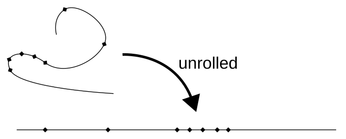

# Inkscape-Unroll-to-Straight-Extension

Unroll a path/shape into a straight line, maintaining the node spacings that were on the original path. Segments can be straight or bezier curves.

Has been tested on Inkscape 1.1 to 1.3beta. Might work with older versions.

## Installation

Add the .inx and .py files to your Inkscape user extensions folder. You can find this by opening Inkscape Preferences (Edit-Preferences) and selecting the System tab. Restart Inkscape and the extension will appear under Extensions - Visualise Path - Unroll Path to Straight Path.

## Usage

Select your path (or mulitple individual paths) and run the extension.

Shapes need to be converted to paths (Object - Object to Path).

The extension can either generate a new straight path with the nodes at the same spacings, number the nodes, label segment lengths, extrude the line to a 2D shape, and add an offset to the extruded shape. You can chose the units, decimal precision, and label prefixes.

------------------------------------------------------------------------

An example usage is making a sewing pattern for a bag. You've drawn your side panels and you need to calculate how long your middle strip needs to be, and you want alignment marks along the middle strip piece that align with the side panel corners.

Select your shape and run the extension (Extensions - Visualise Path - Unroll Path to Straight Path)

This produces a line slightly above the original path's bounding box that is the total length of the path, with nodes placed the same distances along as on the original path. You can generate either a single line (A), a line and an extra group with numbered nodes (B) or labeled segment lengths in the units of your choice (C).

You can add a label prefix, for example if making a top and bottom line.

Numbered nodes are useful if you can't remember which node aligns with which on the original shape. If you have drawn the original path in the wrong order and don't like your starting node, chose your new starting node and use the 'Break Path at Selected Nodes' tool, then re-run the extension. Or trace over your old shape with a new path, which is a bit more reliable if you want to keep it a closed shape.

The extrude and offset features allow you to generate a full middle panel (gusset) with a seam allowance with almost zero effort. Select 'Extrude', and choose your bag width and seam allowance width.

From here you could add a marker style to the nodes for easy alignment with the side panel when sewing.

Using the Cumulative Segment Lengths label option is handy for marking out on fabric/paper without needing to print the image itself.

## Another example

# Prickly Gorse Sewing Guides

I wrote this to assist with making sewing patterns for bike and backpacking bags. Bit of a shameless plug, but if you are interested in sewing your own outdoor gear without making your own patterns, check out [www.payhip.com/pricklygorse](http://www.payhip.com/pricklygorse) for my sewing guides, or [www.pricklygorsegear.com](http://www.pricklygorsegear.com) for my main website.

# Acknowledgements

The code is built upon the Measure Path and Number Nodes extensions that come pre-installed with Inkscape. Huge thanks to the authors of those extensions, and everyone who has contributed to the Inkscape project as a whole.
