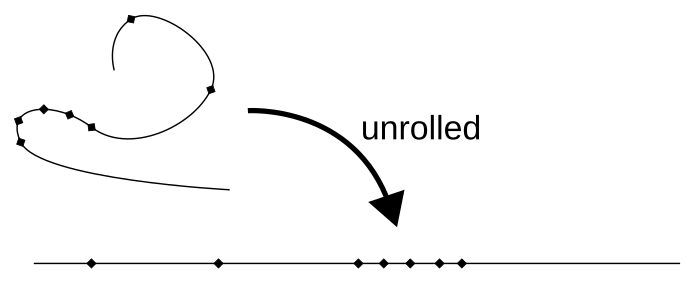
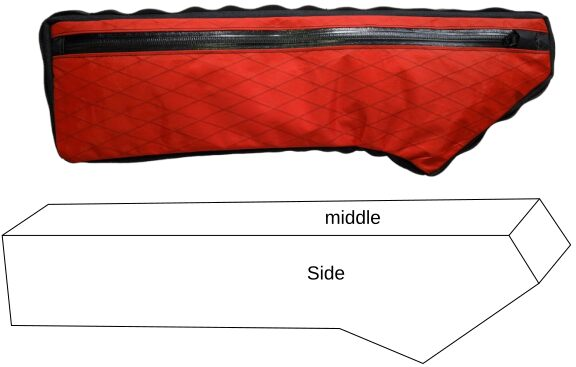
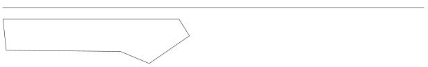
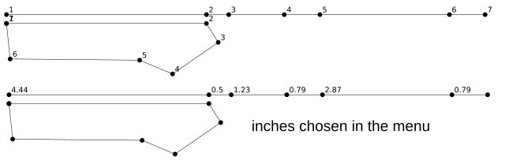
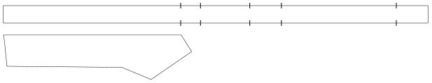
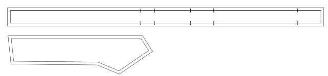
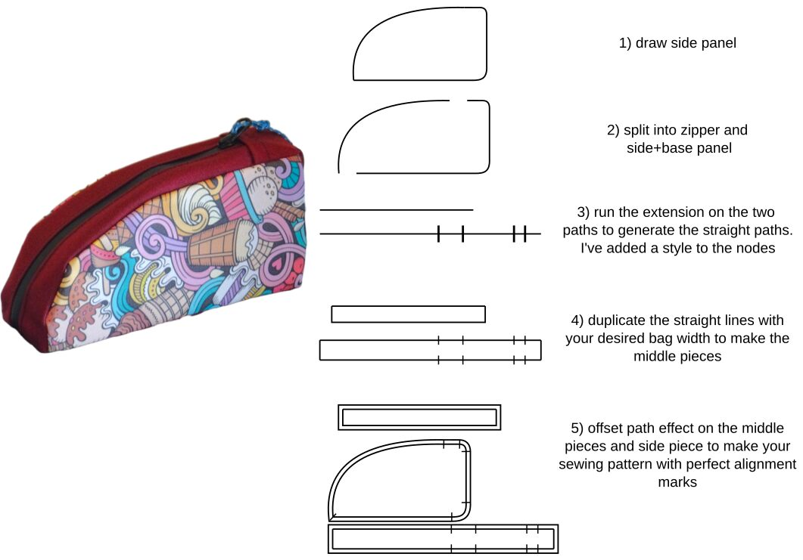

# Inkscape-Unroll-Flatten-Extension

Unroll a path/shape into a straight line, maintaining the node spacings that were on the original path. Segments can be straight or bezier curves.

Tested on Inkscape 1.2 and 1.3 beta

## Installation

Add the .inx and .py files to your Inkscape user extensions folder. You can find this by opening Inkscape Preferences (Edit-Preferences) and selecting the System tab. Restart Inkscape and the extension will appear under Extensions - Visualise Path.

## Usage

Select your path (or paths) and run the extension

Options to draw just a straight line with nodes, add numbered dots, or label the segment lengths. You can choose the decimal precision, scale factor and unit for the segment length labels.

------------------------------------------------------------------------

An example usage is making a sewing pattern for a bag. You've drawn your side panels and you need to calculate how long your middle strip needs to be, and you want alignment marks along the middle strip piece that align with the side panel corners.

Draw the side panels, select it, then run the extension (Extensions - Visualise Path - Unroll and Flatten)

This produces a line slightly above the original path's bounding box that is the total length of the path, with nodes placed the same distances along as on the original path, which you can use for adding alignment marks, notches, text labels etc.

If you are a bit lost and can't remember the order you drew the original path, select 'Add numbered dots' in the extension options. You can also add the lengths of the individual segments to each node.

If you have drawn the original path in the wrong order and don't like your starting node, chose your new starting node and use the 'Break Path at Selected Nodes' tool, then re-run the extension. Or trace over your old shape with a new path, which is a bit more reliable.

Duplicate the path, add the two extra sides, and combine the path to form your middle strip. You can change the stroke style of the nodes, or manually add points and symbols as required for alignment marks/notches.

Then simply use the offset path effect to add seam allowances. You now have a working sewing pattern. Add any extra useful symbols, using the nodes for alignment if required.

Another example

# Prickly Gorse Sewing Guides

I wrote this to assist with making sewing patterns for bike and backpacking bags. If you are interested in sewing your own outdoor gear without making your own patterns, see [www.payhip.com/pricklygorse](http://www.payhip.com/pricklygorse) for my sewing guides, or [www.pricklygorsegear.com](http://www.pricklygorsegear.com) for my main website.

# Acknowledgements

The code is heavily inspired and borrowed from the Measure Path and Number Nodes extensions that come pre-installed with Inkscape. Huge thanks to the authors of those extensions

It's been a while since I've used Python so please excuse any sloppy code.
